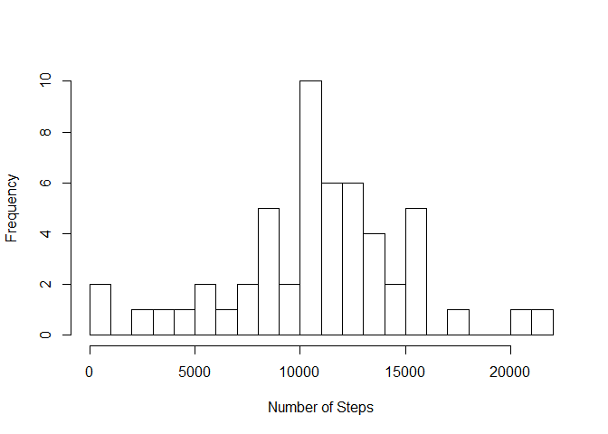
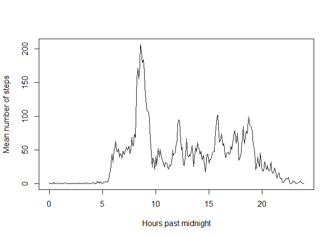
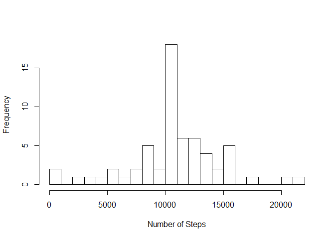
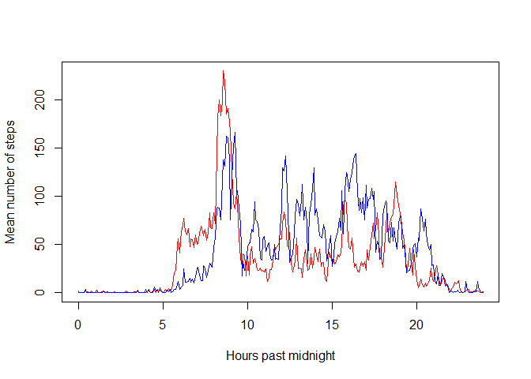

# Reproducible Research: Peer Assessment 1


## Loading and preprocessing the data
First, we load the data and create a separate data without missing values.

```r
data0 <- read.csv("activity.csv")
data <- data0[complete.cases(data0),]
```


## What is mean total number of steps taken per day?
We sum all the `steps` for each `date` using `tapply` and create a histogram.

```r
step <- tapply(data$steps, data$date, sum)
hist(step, breaks=22, xlab="Number of Steps", main="")
```

 

The mean and median are simply calculated as follows:

```r
mean(step, na.rm=TRUE)
```

```
## [1] 10766.19
```

```r
median(step, na.rm=TRUE)
```

```
## [1] 10765
```

## What is the average daily activity pattern?
This time we take the mean of `steps` over each `interval`.
Note that the time is plotted in hours with each 5 minute interval being 1/12 of an hour.

```r
time <- tapply(data$steps, data$interval, mean)

plot(seq(0, 23+11/12, 1/12), time, type="l", xlab="Hours past midnight", ylab="Mean number of steps")
```

 

We can find were the max occurs using the following:

```r
which.max(time)
```

```
## 835 
## 104
```
This tells us the maximum occurs in the 104th interval (8:35 am).
Thus the maximum is:

```r
time[[104]]
```

```
## [1] 206.1698
```

## Imputing missing values
The total number of missing values in the set is calculated as follows:

```r
sum(is.na(data0$steps))
```

```
## [1] 2304
```

To impute we duplicate the data set and then replace the `NA` values by the averages computed previously.

```r
data1 <- data0
for (i in seq_along(data0$steps)) {
        if (is.na(data0[i,1])) {
                data1[i,1] <- time[[as.character(data0[i,3])]]
        }
}
```

Just as before, we sum all the `steps` for each `date` using `tapply` and create a histogram.

```r
step1 <- tapply(data1$steps, data1$date, sum)
hist(step1, breaks=22, xlab="Number of Steps", main="")
```

 

The mean and median are simply calculated as follows:

```r
mean(step1)
```

```
## [1] 10766.19
```

```r
median(step1)
```

```
## [1] 10766.19
```


## Are there differences in activity patterns between weekdays and weekends?
First we create subset of our data to break it into weekdays and weekends.

```r
data1$date <- as.Date(data1$date)
weekday <- subset(data1, weekdays(data1$date) %in% c("Monday", "Tuesday", "Wednesday", "Thursday", "Friday"))
weekend <- subset(data1, weekdays(data1$date) %in% c("Saturday", "Sunday"))
```

Then we apply the mean as done previously and finally plot it with weekdays in red and weekends in blue.

```r
weekdaytime <- tapply(weekday$steps, weekday$interval, mean)
weekendtime <- tapply(weekend$steps, weekend$interval, mean)

plot(seq(0, 23+11/12, 1/12), weekdaytime, type="l", col="red",
     xlab="Hours past midnight", ylab="Mean number of steps")
lines(seq(0, 23+11/12, 1/12), weekendtime, col="blue")
```

 

(Note: I realize this isn't a "panel plot", but I prefer to see the lines on the same graph.)
